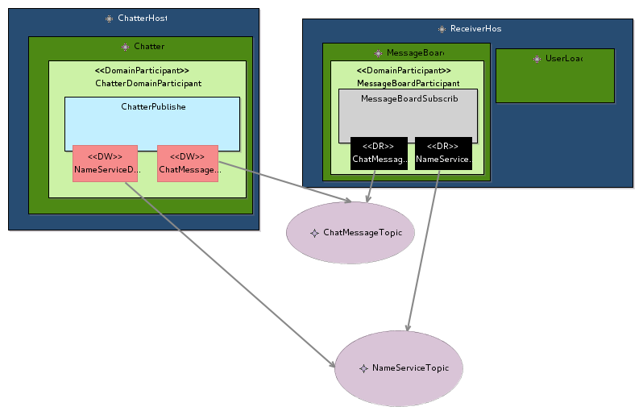

# DDS Modeler Tutorial

## Step 0: Installation

Download the DDSModelerUpdateSite.zip file.
Launch Eclipse, choose a workspace. Go in the Help menu and choose Install new Software.
Click on the Add button. In the Name field put a name for the Update site that will be associated to the downloaded zip file, for example DDS Modeler Update Site. Then click on Archive... and select the downloaded zip file. Click on OK.

If nothing appears uncheck the Group itemsy category box. Check the box near the plugin name or category. Then click on Next and Next. Accept the license (it is the Eclipse Public License) and click on Finish.

Click on OK for the Security Warning. And Yes to restart Eclipse.

## Step 1: Creating the Model

Launch Eclipse and create a workspace to hold your project.

Right-click in the Model Explorer and choose New > Modeling Project. If the entry does not exist in the popup menu choose New > Other and look for Sirius > Modeling Project as shown below.


Give a name to the project and click on Finish.

Right-click on the model and choose New > Other. Then choose Example EMF Model Creation Wizards > DdsMetamodel Model as shown below.


Click on Next and give a name to the file to save the model but do not change the file extension. Click on Next.

In the Model Object field choose DDS System as shown.


The default editor is opened. You can close it.

Right-click on the Modeling Project and choose Viewpoints selection. Check the all the boxes as shown.


Your project is now set to use the DDS Modeler.

## Step 2: Create the Data Model

In the Model Explorer, expand the model by clicking on the arrow next to the model file name. Right-click on the DDS System element that appears and choose New representation > new dataRepresentation. Give a name to the representation and click OK.

Click in the central pane and set the System name property in the Properties tab as shown.


In the Palette (the right pane), click on Data Modules and click in the center pane. In the Properties pane, change the name of the module for ChatModule. Click on Data Structure and click in the ChatModule. Change the name to NameService. Click on DataField and click in the NameService structure. Change Field Name to id and Field Type to long. Select true for the isKey property (the field is selected as key for the Topic type). Perform the same operations to add a field named Name of type string to the NameService structure without checking the box.
Add a Data Structure named ChatMessage to the ChatModule. Add the fields :
- senderId of type long
- messageIndex of type long
- message of type long
Select senderId and messageIndex as key for the Topic associated to the ChatMessage type.

You should end with a model looking like the one shown below.


The DDS Modeler uses QoS profiles to associate the QoS to DDS entities. The next step is to define the QoS profiles associated to the Topics using the defined data model.

## Step 3: Create the QoS Profiles

In the Model Explorer, rigth-click on the DDS System and choose New representation > new qosProfileTreeRepresentation. Give a name to the created representation.

Click on the arrow next to the add tree element icon shown below and choose TopicQosProfile.


Change the name of the created TopicQosProfile to NameServiceQosProfile. Right-click on the created item and choose ReliabilityQos. Right-click on Max blocking time and choose delete. In the Properties pane keep the kind value to RELIABLE. Perform the same operations to associate a DurabilityQos with value TRANSIENT to the NameServiceQosProfile.
Add another TopicQosProfile named ChatMessageQosProfile with the QoS:
- ReliabilityQos: RELIABLE (do not forget to delete the max blocking time)
- DurabilityQos: VOLATILE

You should end with a model looking like the one shown below.


Now that the data model and the QoS are defined, it is time to define the application structure.

## Step 4: Create the Application Structure

The DDS System for this tutorial is made of two hosts ChatterHost and ReceiverHost.
The ChatterHost hosts the Chatter which structure is:
- DomainParticipant ChatterDomainParticipant
|- Publisher ChatterPublisher
|-- DataWriter NameServiceDataWriter
|-- DataWriter ChatMessageDataWriter

The ReceiverHost hosts the MessageBoard and UserLoad applications. The MessageBoard structure is:
- DomainParticipant MessageBoardParticipant
|- Subscriber MessageBoardSubscriber
|-- DataReader NameServiceDataReader
|-- DataReader ChatMessageDataReader
- WaitSet MessageBoardWaitSet
|- ReadCondition on NameServiceDataReader
|- ReadCondition on ChatMessageDataReader

The UserLoad application structure is:
- DomainParticipant UserLoadParticipant
|- Subscriber UserLoadSubscriber
|-- DataReader NameServiceDataReader
|--- Listener with StatusCondition data_available
- Waitset userLoadWaitset
|- GuardCondition userLoadGuard

The next sub-steps describes how the model is created.

### Step 4.1: Create the Applications

Right-click on the DDS System in the Model Explorer and choose New Representation > new applicationStructureRepresentation. Give a name to the representation.

In the palette, click on Host and then click on the center pane. Change its Host name to ChatterHost in the Properties tab. Perform the same operations to create the ReceiverHost.

In the palette, click on Application and click in the ChatterHost. Change the Application name to Chatter. Do the same to create the MessageBoard and UserLoad application on the ReceiverHost.

The obtained model should look like the one shown.


### Step 4.2: Create the DDS Entities for Chatter Application

In the palette, click on DDS Domain Participant (do not hesitate to enlarge the palette to see the tools full name) and click in the Chatter application. Change the name of the DomainParticipant to ChatterDomainParticipant.
The same way:
- Add a Publisher (DDS Publisher tool) named ChatterPublisher to the ChatterDomainParticipant.
- Add a DataWriter (DDS DataWriter tool) named NameServiceDataWriter to the ChatterPublisher.
- Add a DataWriter (DDS DataWriter tool) named ChatMessageDataWriter to the ChatterPublisher.

Add a Topic named NameServiceTopic and set:
- the Ddsdatastructure to NameService
- the Topic Qos Profile to NameServiceQosProfile.

Add a Topic named ChatMessage Topic and set:
- the Ddsdatastructure to ChatMessage
- the Topic Qos Profile to ChatMessageQosProfile.

Through the tool write Topic create a link between:
- NameServiceDataWriter and NameServiceTopic
- ChatMessageDataWriter and ChatMessageTopic

You should obtain a model looking like the one shown


### Step 4.3: Create the DDS Entities for MessageBoard Application

As the operations to create the structure of the MessageBoard application except the WaitSet are similar to those performed to model the Chatter application, the step emphasize on the creation of the WaitSet.
You should have a model looking like the one below.



To add a WaitSet to the application, in the Model Explorer right-click on the DDS Application (located under DDS System > DDS Host ReceiverHost) and choose New representation > new WaitsetTreeRepresentation. Give a name to the representation.

Click on the arrow next to the icon to add new tree elements and choose Waitset. 


Change the name to MessageBoardWaitset.

Right click on MessageBoardWaiset and choose ReadCondition. For the Data Reader property select NameServiceDataReader. For the other properties choose the following values:
- instance state mask: ALIVE_INSTANCE_STATE
- sample state mask: NOT_READ_SAMPLE_STATE
- view state mask: ANY_VIEW_STATE

Create another ReadCondition for MessageBoardWaitset associated to ChatMessageDataReader and with the same mask values.

### Step 4.4: Create the DDS Entities for UserLoad Application

As the operations to create the structure of the MessageBoard application except the Listener are similar to those performed to model the Chatter application, the step emphasizes on the creation of the Listener.
You should have a model looking like the one below.


In the palette, click on DDS DataReaderListener and click on the NameServiceDataReader.
Set the enabled status to DATA_AVAILABLE_STATUS. The model should look like the one below.


## Step 5: Code generation

Right click on the model in the model explorer. Choose Acceleo Model to Text > Generate DDS Model to Java. The code is generated in the src-gen directory of your project.

## Step 6: Code the applications

Switch to the Java Perspective by clicking on the Open Perspective icon shown below and choosing Java.

### Step 6.1: Create the Java code associated to the data model

In a terminal or command window, go to the idl directory generated by the code generator (in your src-gen directory in each host directory). Launch idlpp command to generate the code. For example:
idlpp -S -l java -d ../src ChatSystem.idl

In the next steps a basic knowledge of the use of Eclipse for Java development is considered.

### Step 6.2: Code the Chatter application

Create a Java project. Right-click on the src directory and choose Import > General > File System. Import the ChatModule and chatter directory that are in the modeling project > src-gen > ChatSystem > ChatterHost > src directory. For the import click on Advanced and choose Create links in folder as shown below.


Add the attributes:
- integer chatterId
- String chatterName

Add the code in the area indicated by //Start of User code User defined attributes and //End of user code so that your code won't be overwritten at the next code generation.

Add the getters and setters for these attributes in the section of code //Start of user code User defined methods.

Add the following code in the applicationBehavior method

```java
NameService name = new NameService();
name.id = this.chatterId;
name.Name = this.chatterName;
		
try {
	InstanceHandle nameHandle = this.NameServiceDataWriter.registerInstance(name);
	this.NameServiceDataWriter.write(name, nameHandle);
	if (this.chatterId == -1) {
		this.NameServiceDataWriter.dispose(nameHandle);
		this.NameServiceDataWriter.unregisterInstance(nameHandle);
		System.exit(0);
	}
	int msgIndex = 0;
	ChatMessage msg = new ChatMessage();
	msg.senderId = this.chatterId;
	msg.messageIndex = msgIndex;
	msg.message = "Hi, I am " + this.chatterName + " I will send you ten more messages";
	msgIndex++;
	InstanceHandle msgHandle = this.ChatMessageDataWriter.registerInstance(msg);
	this.ChatMessageDataWriter.write(msg, msgHandle);
	for (int i = 1; i <= 10; i++) {
		try {
			Thread.sleep(1000);
		} catch (InterruptedException e) {
			// TODO Auto-generated catch block
			e.printStackTrace();
		}
		msg.messageIndex = msgIndex;
		msg.message = "Message number " + i;
		this.ChatMessageDataWriter.write(msg, msgHandle);
		msgIndex++;
	}
	this.ChatMessageDataWriter.dispose(msgHandle);
	this.ChatMessageDataWriter.unregisterInstance(msgHandle);
	this.NameServiceDataWriter.dispose(nameHandle);
	this.NameServiceDataWriter.unregisterInstance(nameHandle);
} catch (TimeoutException e) {
	// TODO Auto-generated catch block
	e.printStackTrace();
}
```

Add the following code in the main method.

```java
if (args.length < 2) {
	System.out.println("Usage: java Chatter id name");
	System.exit(0);
}
application.setChatterId(Integer.parseInt(args[0]));
application.setChatterName(args[1]);
```

### Step 6.3: Code the MessageBoard application

The same way as in step 6.1 and 6.2, generate the Java file for the data model and create a Java project for the message board application and import the generated code of the data model and the message board application.

Add an attribute userNames of type Map<Integer, String> to the MessageBoard class.

In the constructor add the initialization of the attribute `this.userNames = new HashMap<>();`.

Add the following code to the applicationBehavior method

```java
boolean isRunning = true;
HashSet<Condition> triggeredConditions = new HashSet<>();
Duration timeout = Duration.infiniteDuration(env);
while (isRunning) {
	try {
		this.MessageBoardWaitset.waitForConditions(triggeredConditions, timeout);
		for (Condition cond : triggeredConditions) {
			if (cond == this.ChatMessageDataReaderRC) {
				List<Sample<ChatMessage>> samples = new ArrayList<>();
				this.ChatMessageDataReader.select().dataState(this.ChatMessageDataReaderRCDS).take(samples);
				for (Sample<ChatMessage> sample : samples) {
					ChatMessage msg = sample.getData();
					String senderName = this.userNames.get(msg.senderId); 
					if (senderName == null) {
						System.out.println(msg.senderId + " sent: " + msg.message);
					} else {
						System.out.println(senderName + " sent: " + msg.message);
					}
				}
			} else if (cond == this.NameServiceDataReaderRC) {
				List<Sample<NameService>> samples = new ArrayList<>();
				this.NameServiceDataReader.select().dataState(this.NameServiceDataReaderRCDS).take(samples);
				for (Sample<NameService> sample : samples) {
					if (sample.getData().id == -1) {
						isRunning = false;
					} else {
						this.userNames.put(sample.getData().id, sample.getData().Name);
					}
				}
			}
		}
	} catch (TimeoutException e) {
		// TODO Auto-generated catch block
		e.printStackTrace();
	}
}
```

### Step 6.4: Code the UserLoad application

#### Step 6.4.1: Code of the Listener

Add the following attributes to the Listener:
- GuardCondition readerGuardCondition
- Subscriber readerSubscriber
- DataReader<NameService> NameServiceDataReader

Add the following code in the onDataAvailable method of the Listener.

```java
List<Sample<NameService>> samples = new ArrayList<>();
DataState ds = readerSubscriber.createDataState();
ds = ds.with(SampleState.NOT_READ).with(ViewState.NEW).with(InstanceState.ALIVE);
this.NameServiceDataReader.select().dataState(ds).take(samples);
for (Sample<NameService> sample : samples ) {
	if (sample.getData().id == -1) {
		System.out.println("User load exits");
		this.readerGuardCondition.setTriggerValue(true);
	} else {
		System.out.println("User " + sample.getData().Name + " joins the chat");
	}
}
```

Generate the setter methods for the added attributes.

#### Step 6.4.2: Code of the UserLoad class

Add the following code in the applicationBehavior method

```java
boolean isRunning = true;
while (isRunning) {
	HashSet<Condition> triggeredConditions = new HashSet<>();
	Duration timeout = Duration.infiniteDuration(env);
	try {
		this.userLoadWaitset.waitForConditions(triggeredConditions, timeout);
		for (Condition cond : triggeredConditions) {
			if (cond == this.userLoadGuard) {
				System.out.println("Guard");
				isRunning = false;
			}
		}
	} catch (TimeoutException e) {
		// TODO Auto-generated catch block
		e.printStackTrace();
	}
}
```